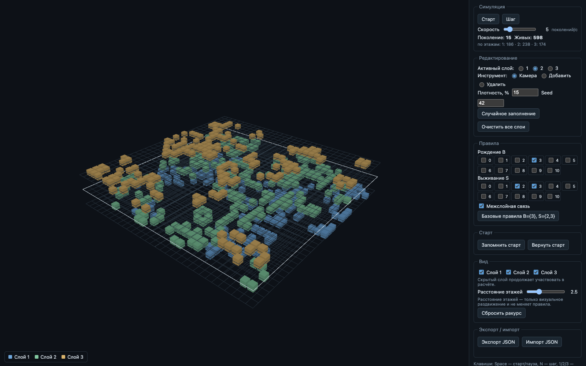

# Трёхслойная «Жизнь»

Браузерный эксперимент-песочница: клеточный автомат «Жизнь» Конвея на трёх
этажах поля 32 × 32 с настраиваемыми правилами B/S, опциональной межслойной
связью и экспортом/импортом экспериментов в JSON. Сцена — Three.js (WebGL),
интерфейс на русском.



**Живая страница (GitHub Pages):** https://blucknote.github.io/layered-life/

## Запуск

Требуется Node.js ≥ 20.19 (проверено на v26.7.0).

```bash
npm install
npm run dev        # http://localhost:5173
npm test           # unit-тесты ядра (vitest)
npm run build      # tsc --noEmit + vite build → dist/
npm run preview    # раздать собранную dist/ на http://localhost:4173
```

## Модель мира

- Поле фиксировано: **32 × 32 × 3** (ширина × высота × этажа).
- Состояние — `Uint8Array`, индекс клетки: `x + width * (y + height * z)`;
  `x` меняется быстрее всего, затем `y`, затем `z`.
- Обновление строго синхронное: два буфера, следующее поколение считается
  из неизменного предыдущего.

### Соседство

Для клетки `(x, y, z)`:

- внутрислойные соседи `(x+dx, y+dy, z)`, `dx, dy ∈ {−1,0,1}`, кроме `(0,0)`;
- при включённой **межслойной связи** дополнительно `(x, y, z−1)` и `(x, y, z+1)`;
- диагонали других слоёв **не** считаются; собственная клетка **не** считается;
- выходов за границы нет (wrap отсутствует, отсутствующие координаты дают 0);
- слои 0 и 2 напрямую **не** связаны — только через слой 1;
- максимум соседей: 10 у среднего слоя, 9 у крайних; на границах поля меньше.

При выключенной связи — три независимые «Жизни» с общими B/S.

### Правила

Для числа живых соседей `n`:

```text
клетка мертва  → оживает, если n ∈ B
клетка жива    → выживает, если n ∈ S
```

B и S — произвольные наборы переключателей `0…10` (это экспериментальное
расширение, а не обещание поведения классической 2D-версии). Базовые правила:
**B = {3}, S = {2,3}**; кнопка «Базовые правила» возвращает к ним.
Изменение B/S или связи ставит симуляцию на паузу, сохраняя поле и поколение.

## Управление

| Элемент | Действие |
| --- | --- |
| Старт / Пауза, `Space` | запуск/остановка |
| Шаг, `N` | ровно один шаг; симуляция остаётся на паузе |
| Скорость (1–30) | поколений в секунду; скорость отделена от FPS накопителем времени |
| Активный слой, `1/2/3` | этаж для редактирования; выбор скрытого слоя делает его видимым |
| Инструмент «Камера» | перетаскивание вращает вид, колесо — зум, правая кнопка — панорама |
| Инструмент «Добавить» / «Удалить» | клик по плоскости активного слоя ставит/снимает клетку (попадание считается пересечением луча с плоскостью слоя, работает и по пустым клеткам); под курсором — контур целевой клетки; клики вне поля игнорируются; начало редактирования ставит паузу |
| Плотность 0–100 %, Seed | параметры случайного заполнения; кнопка заполняет поле и делает его новым стартом (поколение = 0, пауза) |
| Очистить все слои | пустое поле как новый старт |
| Запомнить старт / Вернуть старт | «вернуть» восстанавливает клетки и обнуляет поколение, **сохраняя текущие B/S и связь** — один старт можно прогонять при разных правилах |
| Слой 1/2/3 (видимость) | скрытие влияет только на отрисовку: **скрытый слой продолжает участвовать в расчёте** |
| Расстояние этажей (1–6) | только визуальное раздвижение; правила и результат шага не меняются |
| Сбросить ракурс | камера к исходному наклонному виду |
| Экспорт JSON / Импорт JSON | см. формат ниже |

Горячие клавиши не перехватываются, пока фокус в поле ввода.
При уходе вкладки в фон симуляция ставится на пауза; накопившееся время
при возврате не доигрывается. Без WebGL показывается сообщение вместо пустого экрана.

## Формат JSON (`formatVersion: 1`)

```json
{
  "formatVersion": 1,
  "width": 32, "height": 32, "depth": 3,
  "generation": 12,
  "rules": { "birth": [3], "survive": [2, 3], "coupling": true },
  "speed": 5,
  "seed": 42,
  "density": 15,
  "cells": [0, 1, "..."],
  "start": [0, 1, "..."]
}
```

- `cells` — текущее поле, `start` — сохранённый старт; оба — плоские массивы
  длины `32*32*3 = 3072` со значениями `0/1`, порядок индексов как в модели мира.
- `speed` — целое 1–30; `seed` — целое 0…4294967295; `density` — целое 0–100.
- Импорт проверяется целиком: версия формата, размеры (только 32×32×3),
  длины массивов, бинарность клеток, диапазоны B/S (0…10) и числовых
  параметров; файл больше **1 МБ** отклоняется не читая. Некорректный файл
  даёт понятную ошибку на русском и **не меняет текущий мир**.
  Импорт восстанавливает эксперимент на паузе.
- Камера в JSON не сохраняется (не обязательна по ТЗ).

## Алгоритм seed

Заполнение детерминировано и не использует `Math.random` — PRNG
**mulberry32** (Tomasz Stawicki, public domain), состояние — uint32:

```text
s = seed >>> 0
next():
  s = (s + 0x6D2B79F5) >>> 0
  t = s
  t = imul(t ^ (t >>> 15), t | 1) >>> 0
  t = (t ^ (t + imul(t ^ (t >>> 7), t | 61))) >>> 0
  return ((t ^ (t >>> 14)) >>> 0) / 4294967296
```

Клетки обходятся в порядке индекса (x быстрее всего, затем y, затем z);
клетка живая, если `next() < density / 100`. Одинаковые seed, размеры и
плотность всегда дают одинаковое поле.

## Архитектура

```text
src/core/world.ts          чистое ядро: состояние, соседство, step (без DOM/Three)
src/core/prng.ts           mulberry32 + randomFill
src/core/serialization.ts  экспорт/импорт JSON + валидация
src/render/renderer.ts     Three.js: InstancedMesh на слой, OrbitControls, hover-контур
src/main.ts                связывание ядро ↔ рендер ↔ DOM-панель
tests/simulation.test.ts   приёмочные тесты ядра (vitest)
```

Кубики рисуются одним `InstancedMesh` на слой (геометрия/материалы
переиспользуются), pixel ratio ограничен 2. Скорость симуляции отделена от
FPS; за кадр — не более 5 догоняющих шагов.

## Ограничения

- Размер поля фиксирован 32 × 32 × 3 (интерфейса изменения размера нет;
  импорт других размеров отклоняется).
- Редактирование — одиночные клики, без рисования кистью.
- Симуляция на CPU; Web Workers/GPU не использовались (не требовалось по ТЗ).
- Один набор B/S на все слои; нет 4D, истории, произвольного графа связей,
  соседства из 26 позиций и мультиплеера (осознанно вне MVP).
- Проверено в headless Chromium (SwiftShader). Safari/Apple Silicon и
  реальная GPU-производительность — не проверялись (см. `REPORT.md`).
